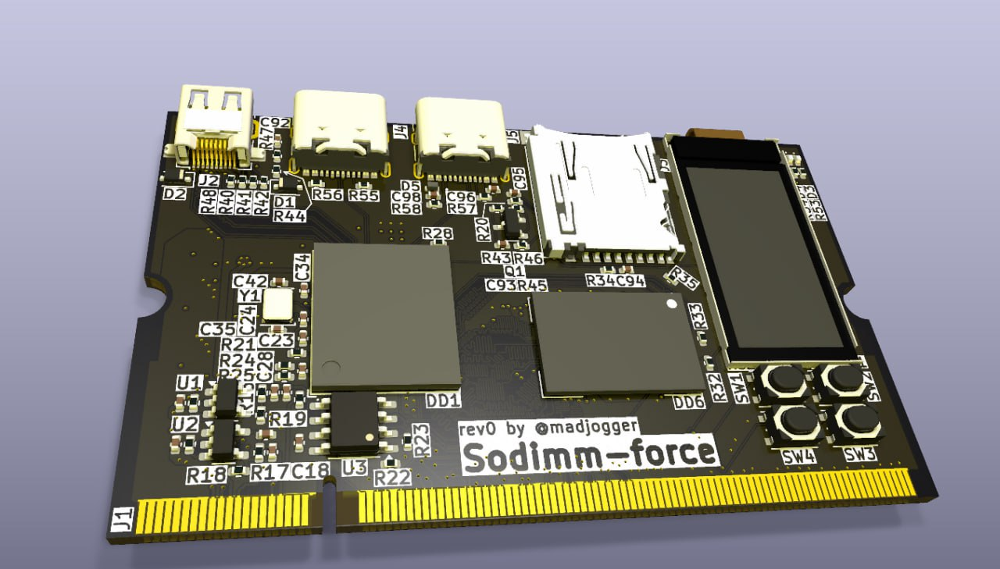
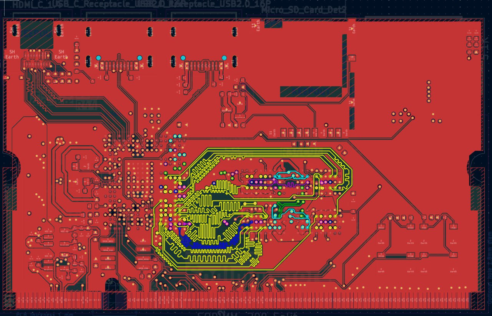
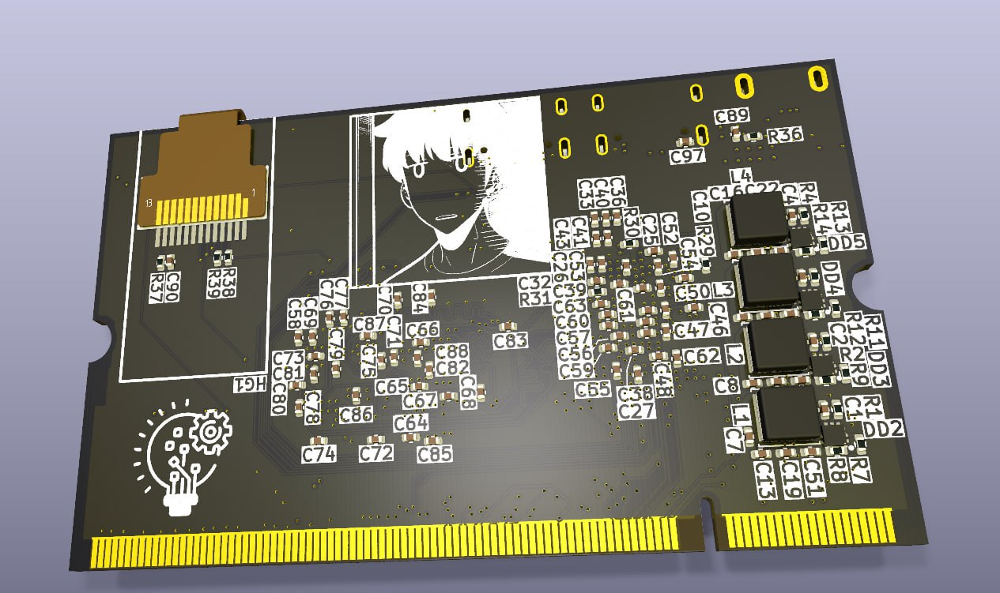

# Sodimm-force rev0 
> [!IMPORTANT]
> Project wasn't produced and tested yet.
### Implementation of Orange Pi Zero 2W in sodimm form-factor

<table style="width: 100%; table-layout: fixed;">
  <tr>
    <td rowspan="4">
      
    </td>  
    <td rowspan="4">
      
    </td>  
  </tr>
</table>

## 🎲Revisions and logs:
<table>
  <tr>
    <td>
      <strong>Revision 0</strong>
    </td>   
    <td>
      <strong>10 March 2025</strong>
    </td> 
    <td>
      CPU H616, DDR MT53E1G32D2FW-046
    </td>
    <td>
      <strong>[x] not produced</strong>
    </td>
  </tr>
</table>

## 🧊 What Is This Project?

🐾 This entire project is just my take on an embedded compute module — but built around the Allwinner H616 SoC.

Not a clone. Not a dev board.  
Just **a compact, modular, SODIMM-sized brain** for custom systems. 💡

---

### 🛠️ The Vision

🐈 Made it to explore:
- How far can you push a **low-cost ARM SoC** in real embedded applications?
- Can we build something **industrial-grade**, yet **hackable and open**?
- What if your compute unit was **as easy to swap as RAM**?

So I said: *"Let’s make a tiny computer on a SODIMM."*  
And here we are. ✨

---

### 🔌 Key Features (SODIMM Form Factor)

- 🧩 **Modular by design** — plug into any carrier board
- 🧠 **Allwinner H616** — Quad-core Cortex-A53, Mali-G31 GPU, 4K@60 decoding
- 💾 **4GB LPDDR4** (Micron, automotive-grade) — fast & stable
- 💾 **microSD slot** — boot OS, store logs, update firmware
- 🖤 **EEPROM (ST M24M02)** — stores calibration, MAC, serials
- 📺 **0.96" IPS display (ST7735)** — built-in UI, no external screen needed
- 🔘 **4 tactile buttons** — navigate menus, trigger actions
- 🔌 **microHDMI 2.0** — 4K video out
- 🔌 **2× USB Type-C** — data, OTG, power
- ⚡ **DC-DC + LDO power** (SY8843QWC + SPX3819) — clean, efficient, stable
- 🛡️ **ESD protection** on all critical lines — because real world is harsh

---

### 🎯 Why H616?

🌟 Not the most powerful.  
🌟 Not the newest.  

But:
- ✅ **Mature Linux support** (Armbian, Debian, Buildroot)
- ✅ **Low power & heat** — perfect for fanless, compact designs
- ✅ **Full HDMI 2.0 + USB OTG** — rare at this price
- ✅ **Industrial temp RAM** — works where others fail
- ✅ **Open-ish ecosystem** — community-driven, no NDA hell

---

### 🧪 This Is a Prototype — Not Production

- 🚧 **Revision 0** — proof of concept
- ❌ `[x] not produced` — still not produced

## **˙✧˖°📷 ༘ ⋆｡˚ Stay tuned for further updates.˙✧˖°📷 ༘ ⋆｡˚**

### ***For any questions or collaborations i can be found on Telegram: [@madjogger](https://t.me/madjogger)***